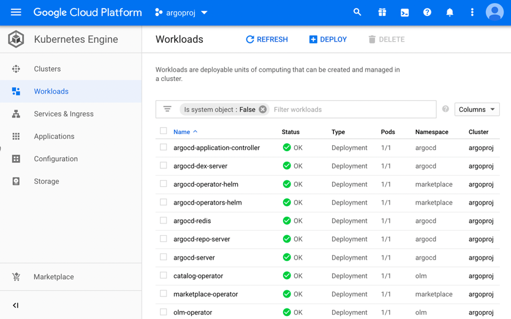
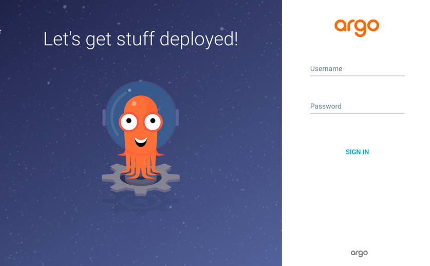

*********************
Google Cloud Platform
*********************

A installation guide for Operator Lifecycle Manager, 
Argo CD Operator (Helm), Argo CD, 
Argo CD CLI and the Guestbook Example in Google Cloud Platform Kubernetes Engine.

.. include:: ../_static/kubernetes_clusteradmin.txt

Prerequisites
=============

.. image:: https://img.shields.io/badge/kubernetes-1.16-blue.svg
   :target: https://v1-16.docs.kubernetes.io/
   :alt: Kubernetes
.. image:: https://img.shields.io/badge/olm-0.13.0-blue.svg
   :target: https://github.com/operator-framework/operator-lifecycle-manager
   :alt: Operator Lifecycle Manager

As usual you need to have access to an up and running Kubernetes cluster. 

.. _example: https://github.com/disposab1e/argocd-operator-helm/blob/release-0.0.3/deploy/kubernetes/examples/gcp.sh

.. Caution:: We recommend adding a LoadBalancer to your cluster!

.. include:: ../_static/kubernetes_olm.txt

.. image:: https://img.shields.io/badge/Screenshot-Dashboard-blue
   :target: ../_static/gcp_01.png
   :alt: Screenshot

.. include:: ../_static/kubernetes_operator_installation.txt

.. include:: ../_static/kubernetes_operator_olm_installation.txt

.. image:: https://img.shields.io/badge/Screenshot-Dashboard-blue.svg
   :target: ../_static/gcp_02.png
   :alt: Screenshot

.. include:: ../_static/kubernetes_operator_manual_installation.txt

.. image:: https://img.shields.io/badge/Screenshot-Dashboard-blue.svg
   :target: ../_static/gcp_03.png
   :alt: Screenshot

Argo CD Installation
=====================

Install Argo CD server components and Argo CD command line interface.

Argo CD
-------

Install Argo CD from the command line.

.. Attention:: This example installation assumes you have a Load Balancer available in your GCP cluster!

.. Note:: This operator shares all `configuration values`_ from the Argo CD Helm Chart.

.. _configuration values: https://github.com/disposab1e/argocd-operator-helm/blob/release-0.0.3/helm-charts/argo-cd/README.md

.. image:: https://img.shields.io/badge/git%20clone-https%3A%2F%2Fgithub.com%2Fdisposab1e%2Fargocd--operator--helm.git-9cf.svg
   :target: https://github.com/disposab1e/argocd-operator-helm
   :alt: git clone

.. code-block:: bash
   
    kubectl apply -f guides/kubernetes/examples/gcp.yaml

.. include:: ../_static/kubernetes_argocd_installation.txt

.. image:: https://img.shields.io/badge/Screenshot-Dashboard-blue.svg
   :target: ../_static/gcp_04.png
   :alt: Screenshot

Argo CD Ingress
---------------

You will find your Load Balancer IP in the section ``Services & Ingress``.

.. Hint:: 
    Now point your browser to: :guilabel:`https://<LoadBalancer Endpoint>:443`

Argo CD CLI
-----------

Argo CD provides a command line interface. 
To be in sync with your Argo CD version you can download it directly from 
the Argo CD installation.

Download CLI
""""""""""""

.. code-block:: bash
   
    curl --insecure https://<LoadBalancer Endpoint>:443/download/argocd-linux-amd64 -o argocd  

.. include:: ../_static/kubernetes_change_default_password.txt

Login Argo CD
"""""""""""""

.. code-block:: bash
   
    argocd login --insecure --username admin --password Password1! <LoadBalancer Endpoint port 443>

.. include:: ../_static/common_guestbook_example.txt

.. include:: ../_static/kubernetes_cleanup.txt
