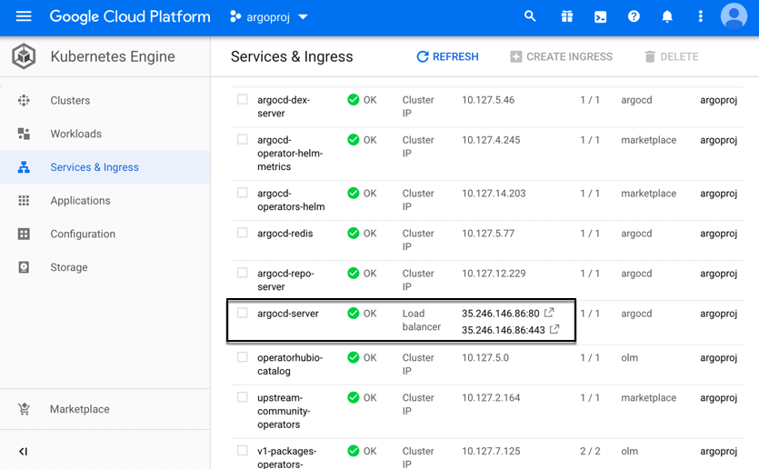

*********************
Google Cloud Platform
*********************

A installation guide for Operator Lifecycle Manager, Operator Marketplace, 
Argo CD Operator (Helm), Argo CD, 
Argo CD CLI and the Guestbook Example in Google Cloud Platform Kubernetes Engine.

.. include:: ../_static/kubernetes_clusteradmin.txt

Prerequisites
=============

.. image:: https://img.shields.io/badge/Kubernetes-1.14-blue
   :target: https://v1-14.docs.kubernetes.io/
   :alt: Kubernetes
.. image:: https://img.shields.io/badge/OLM-0.12.0-red
   :target: https://github.com/operator-framework/operator-lifecycle-manager
   :alt: Operator Lifecycle Manager

Kubernetes
----------

As usual you need to have access to an up and running Kubernetes cluster. 
If you have not yet installed a cluster, here is an example_ cluster that we use.

.. _example: https://github.com/disposab1e/argocd-operator-helm/blob/master/deploy/kubernetes/examples/gcp.sh

.. Caution:: We recommend adding a LoadBalancer to your cluster!

.. include:: ../_static/kubernetes_olm.txt

.. image:: https://img.shields.io/badge/Screenshot-Dashboard-blue
   :target: ../_static/gcp_01.png
   :alt: Screenshot

.. include:: ../_static/kubernetes_mo.txt

.. image:: https://img.shields.io/badge/Screenshot-Dashboard-blue
   :target: ../_static/gcp_02.png
   :alt: Screenshot

.. include:: ../_static/kubernetes_operator_installation.txt

.. include:: ../_static/kubernetes_operator_installation_marketplace.txt

.. image:: https://img.shields.io/badge/Screenshot-Dashboard-blue
   :target: ../_static/gcp_03.png
   :alt: Screenshot

.. include:: ../_static/kubernetes_stupid.txt

.. include:: ../_static/kubernetes_operator_installation_local.txt

.. image:: https://img.shields.io/badge/Screenshot-Dashboard-blue
   :target: ../_static/gcp_04.png
   :alt: Screenshot

Argo CD Installation
=====================

Install Argo CD server components and Argo CD command line interface.

Argo CD
-------

.. Attention:: This example installation assumes you have a Load Balancer available in your GCP cluster!

This operator shares all `configuration values`_ from the Argo CD Helm Chart.

.. _configuration values: https://github.com/disposab1e/argocd-operator-helm/blob/master/helm-charts/argo-cd/README.md

.. include:: ../_static/kubernetes_argocd_installation_command_line.txt

.. image:: https://img.shields.io/badge/Screenshot-Dashboard-blue
   :target: ../_static/gcp_05.png
   :alt: Screenshot

Argo CD Ingress
---------------

You will find your Load Balancer IP in the section ``Services & Ingress``.

.. Hint:: 
    Now point your browser to: :guilabel:`https://<LoadBalancer Endpoint>:443`

.. image:: ../_static/common_argocd_login.png

Argo CD CLI
-----------

Argo CD provides a command line interface. 
To be in sync with your Argo CD version you can download it directly from 
the Argo CD installation.

Download CLI
""""""""""""

.. code-block:: bash
   
    curl --insecure https://<LoadBalancer Endpoint>:443/download/argocd-linux-amd64 -o argocd  

.. include:: ../_static/kubernetes_change_default_password.txt

Login Argo CD
"""""""""""""

.. code-block:: bash
   
    argocd login --insecure --username admin --password Password1! <LoadBalancer Endpoint port 443>

.. include:: ../_static/common_guestbook_example.txt

.. include:: ../_static/kubernetes_cleanup.txt
