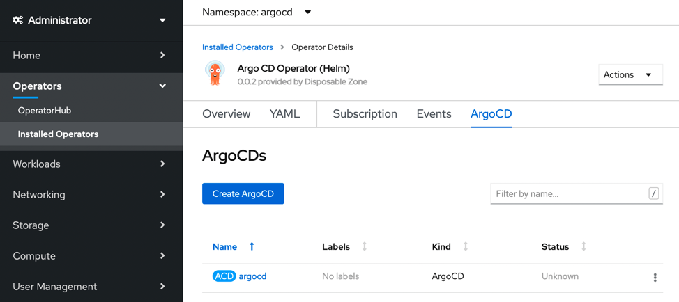
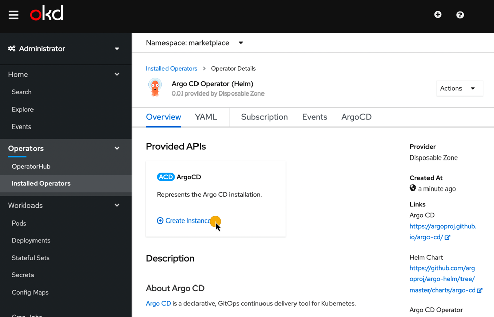
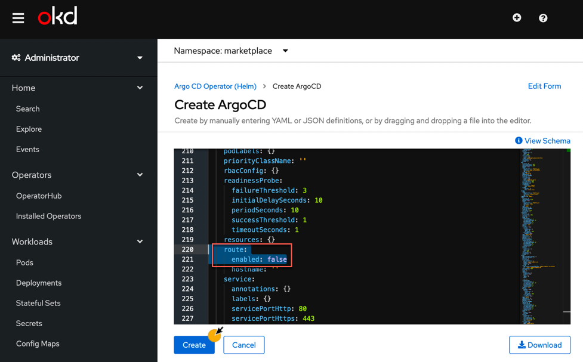
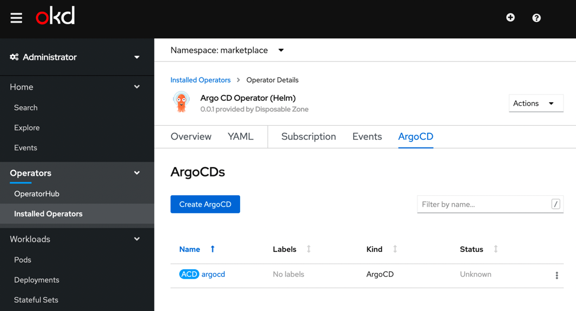

********
Minikube
********

A installation guide for Operator Lifecycle Manager, Operator Marketplace, 
Argo CD Operator (Helm), Argo CD, 
Argo CD CLI and the Guestbook Example in Minikube.

.. include:: ../_static/kubernetes_clusteradmin.txt

Prerequisites
=============

.. image:: https://img.shields.io/badge/minikube-v1.5.2-blue
   :target: https://github.com/kubernetes/minikube
   :alt: minikube
.. image:: https://img.shields.io/badge/Kubernetes-1.14-blue
   :target: https://v1-14.docs.kubernetes.io/
   :alt: Kubernetes
.. image:: https://img.shields.io/badge/OLM-0.12.0-red
   :target: https://github.com/operator-framework/operator-lifecycle-manager
   :alt: Operator Lifecycle Manager

Kubernetes
----------

As usual you need to have access to an up and running Minikube_ Kubernetes cluster. 
If you have not yet installed a cluster, here is an example_ that we use.

To follow the screenshots in this guide it's recommended to add the Dashboard 
to your Minikube installation.

.. _Minikube: https://github.com/kubernetes/minikube
.. _example: https://github.com/disposab1e/argocd-operator-helm/blob/release-0.0.1/deploy/kubernetes/examples/minikube.sh

.. code-block:: bash
    
    minikube addons enable dashboard
    minikube dashboard

.. include:: ../_static/kubernetes_olm.txt

.. image:: https://img.shields.io/badge/Screenshot-Dashboard-blue
   :target: ../_static/minikube_01.png
   :alt: Screenshot

.. include:: ../_static/kubernetes_mo.txt

    
.. image:: https://img.shields.io/badge/Screenshot-Dashboard-blue
   :target: ../_static/minikube_02.png
   :alt: Screenshot

Web Console
"""""""""""

.. Caution:: You need a local (not inside Minikube!) Docker or Podman installation!

To follow the screenshots in this guide it's recommended to install the Marketplace Web Console.

.. code-block:: bash

    git clone https://github.com/operator-framework/operator-lifecycle-manager.git
    
    ./scripts/run_console_local.sh

.. image:: https://img.shields.io/badge/Browser-http%3A%2F%2Flocalhost%3A9000-9cf
   :target: http://localhost:9000
   :alt: Point your Browser to

.. image:: https://img.shields.io/badge/Screenshot-Console-red
   :target: ../_static/minikube_03.png
   :alt: Screenshot

.. include:: ../_static/kubernetes_operator_installation.txt

.. include:: ../_static/kubernetes_operator_installation_marketplace.txt

.. image:: https://img.shields.io/badge/Screenshot-Dashboard-blue
   :target: ../_static/minikube_04.png
   :alt: Screenshot
.. image:: https://img.shields.io/badge/Screenshot-Console-red
   :target: ../_static/minikube_05.png
   :alt: Screenshot

.. include:: ../_static/kubernetes_stupid.txt

.. include:: ../_static/kubernetes_operator_installation_local.txt

.. image:: https://img.shields.io/badge/Screenshot-Dashboard-blue
   :target: ../_static/minikube_06.png
   :alt: Screenshot

Argo CD Installation
=====================

Install Argo CD server components and Argo CD command line interface.

Argo CD
-------

Install Argo CD from the command line (quick) or when you have the 
`Web Console`_ up and running through a nice web user interface. This operator shares all `configuration values`_ from the Argo CD Helm Chart.

.. _configuration values: https://github.com/disposab1e/argocd-operator-helm/blob/release-0.0.1/helm-charts/argo-cd/README.md
 

Command Line
""""""""""""

.. include:: ../_static/kubernetes_argocd_installation_command_line.txt

.. image:: https://img.shields.io/badge/Screenshot-Dashboard-blue
   :target: ../_static/minikube_07.png
   :alt: Screenshot

Web UI
""""""

.. image:: https://img.shields.io/badge/Screenshot-Dashboard-blue
   :target: ../_static/minikube_07.png
   :alt: Screenshot

Argo CD Ingress
---------------

For simplicity we use port forwarding.

.. code-block:: bash
   
    kubectl port-forward svc/argocd-server -n argocd 9001:443

.. image:: https://img.shields.io/badge/Browser-http%3A%2F%2Flocalhost%3A9001-9cf
   :target: http://localhost:9001
   :alt: Point your Browser to

.. image:: ../_static/common_argocd_login.png

Argo CD CLI
-----------

Argo CD provides a command line interface. 
To be in sync with your Argo CD version you can download it directly from 
the Argo CD installation.

Download CLI
""""""""""""

.. code-block:: bash
   
    curl --insecure https://localhost:9001/download/argocd-linux-amd64 -o argocd  

.. include:: ../_static/kubernetes_change_default_password.txt

Login Argo CD
"""""""""""""

.. code-block:: bash
   
    argocd login --insecure --username admin --password Password1! localhost:9001

.. include:: ../_static/common_guestbook_example.txt

.. include:: ../_static/kubernetes_cleanup.txt
