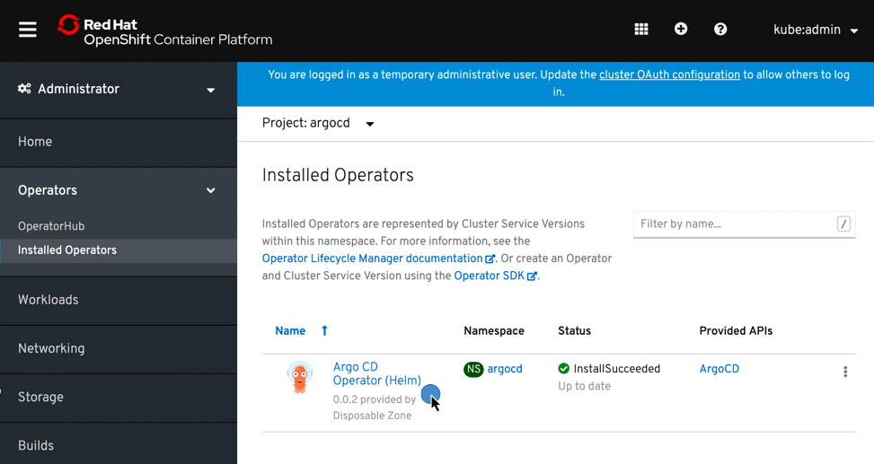
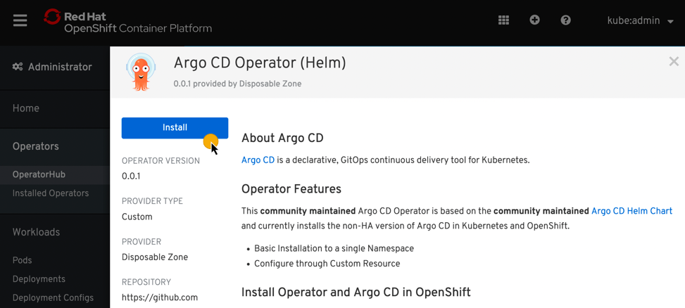
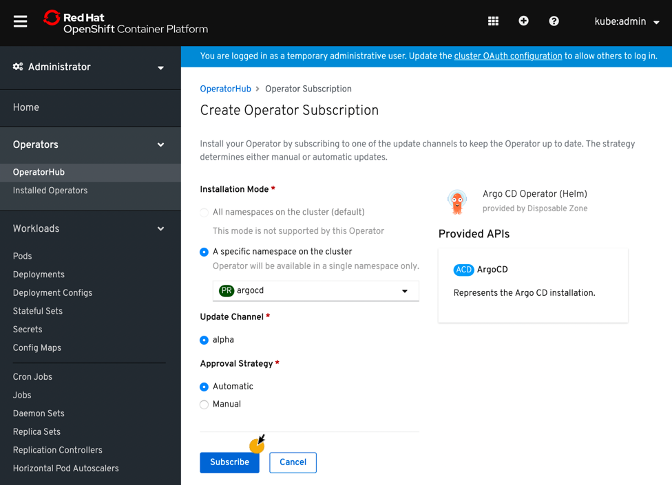
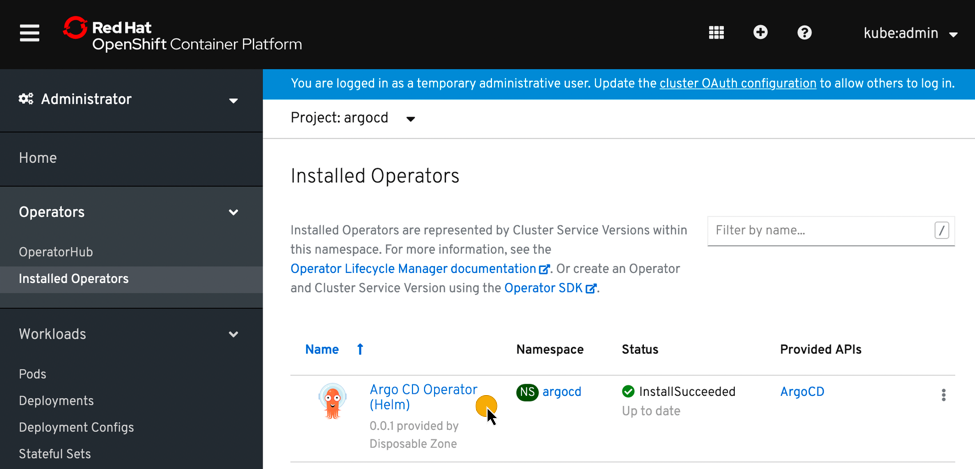
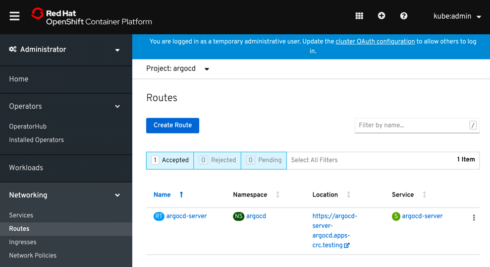

********************
CodeReady Containers 
********************

A installation guide for Argo CD Operator (Helm), Argo CD, 
Argo CD CLI and the Guestbook Example in CodeReady Containers.

.. Note:: 
   You have to be in the :guilabel:`cluster-admin` ClusterRole to install the operator and Argo CD.

Prerequisites
=============

.. image:: https://img.shields.io/badge/crc-1.1.0-red.svg
   :target: https://github.com/code-ready/crc
   :alt: CodeReady Containers
.. image:: https://img.shields.io/badge/ocp-4.2-red.svg
   :target: https://www.openshift.com/products/container-platform
   :alt: OpenShift Container Platform

OpenShift
---------

As usual you need to have access to an up and running `OpenShift`_ cluster. 

.. _OpenShift: https://github.com/code-ready/crc

It's recommended to open the OpenShift Console to follow the screenshots in this guide.

.. code-block:: bash

    crc console

Operator Installation
=====================

It’s possible to install the operator using the Operator Lifecycle Manager or manually.

Operator Lifecycle Manager
--------------------------

This installation method installs the operator using an `OLM Catalog`_.

.. _OLM Catalog: https://quay.io/repository/disposab1e/argocd-operator-helm-registry

.. image:: https://img.shields.io/badge/git%20clone-https%3A%2F%2Fgithub.com%2Fdisposab1e%2Fargocd--operator--helm.git-9cf.svg
   :target: https://github.com/disposab1e/argocd-operator-helm
   :alt: git clone

.. code-block:: bash

    oc apply -f guides/openshift/olm/namespace.yaml
    oc apply -f guides/openshift/olm/catalog-source.yaml
    oc apply -f guides/openshift/olm/operator-group.yaml
    oc apply -f guides/openshift/olm/subscription.yaml
    
    oc rollout status -w deployment/argocd-operator-helm -n argocd

.. image:: https://img.shields.io/badge/Screenshot-Console-red.svg
   :target: ../_static/crc_01.png
   :alt: Screenshot
.. image:: https://img.shields.io/badge/Screenshot-Console-red.svg
   :target: ../_static/crc_02.png
   :alt: Screenshot
.. image:: https://img.shields.io/badge/Screenshot-Console-red.svg
   :target: ../_static/crc_03.png
   :alt: Screenshot

Manual
------

You can install the operator from local sources without having to install an OLM Catalog.

.. Note:: No channel subscription and automatic operator updates available with this method. 

.. image:: https://img.shields.io/badge/git%20clone-https%3A%2F%2Fgithub.com%2Fdisposab1e%2Fargocd--operator--helm.git-9cf.svg
   :target: https://github.com/disposab1e/argocd-operator-helm
   :alt: git clone

.. code-block:: bash

    oc apply -f guides/openshift/manual/namespace.yaml
    oc apply -f guides/openshift/manual/service_account.yaml
    oc apply -f guides/openshift/manual/role.yaml
    oc apply -f guides/openshift/manual/role_binding.yaml
    oc apply -f guides/openshift/manual/crd.yaml
    oc apply -f guides/openshift/manual/deployment.yaml

    oc rollout status -w deployment/argocd-operator-helm -n argocd

.. image:: https://img.shields.io/badge/Screenshot-Console-red.svg
   :target: ../_static/crc_04.png
   :alt: Screenshot

Argo CD Installation
=====================

Install Argo CD server components and Argo CD command line interface.

Argo CD
-------

Install Argo CD from the `Command Line`_ (quick) or through the 
Web Console with a nice `Web UI`_. 

.. Note:: This operator shares all `configuration values`_ from the Argo CD Helm Chart.

.. _configuration values: https://github.com/disposab1e/argocd-operator-helm/blob/release-0.0.2/helm-charts/argo-cd/README.md

Command Line
""""""""""""

.. image:: https://img.shields.io/badge/git%20clone-https%3A%2F%2Fgithub.com%2Fdisposab1e%2Fargocd--operator--helm.git-9cf.svg
   :target: https://github.com/disposab1e/argocd-operator-helm
   :alt: git clone

.. code-block:: bash
   
    oc apply -f guides/openshift/examples/crc.yaml

    oc get ArgoCDs argocd -n argocd

    oc rollout status -w deployment/argocd-application-controller -n argocd
    oc rollout status -w deployment/argocd-dex-server -n argocd
    oc rollout status -w deployment/argocd-redis -n argocd
    oc rollout status -w deployment/argocd-repo-server -n argocd
    oc rollout status -w deployment/argocd-server -n argocd

.. image:: https://img.shields.io/badge/Screenshot-Console-red
   :target: ../_static/crc_05.png
   :alt: Screenshot

Web UI
""""""

.. image:: https://img.shields.io/badge/Screenshot-Console-red
   :target: ../_static/crc_05.png
   :alt: Screenshot

Argo CD Route
-------------

Argo CD web frontend is immediately accessible through an SSL passthrough route.

.. image:: https://img.shields.io/badge/Browser-https%3A%2F%2Fargocd--server--argocd.apps--crc.testing%2F-9cf
   :target: https://argocd-server-argocd.apps-crc.testing
   :alt: Point your Browser to

.. image:: ../_static/common_argocd_login.png

To access this route also form the `Argo CD CLI`_ you have to 
manually add this route to your ``/etc/hosts`` file.

.. code-block:: bash
   
    sudo vi /etc/hosts

    # End of section
    # Added by Docker Desktop
    # To allow the same kube context to work on the host and the container:
    127.0.0.1 kubernetes.docker.internal
    192.168.64.73 api.crc.testing oauth-openshift.apps-crc.testing argocd-server-argocd.apps-crc.testing

Argo CD CLI
-----------

Argo CD provides a command line interface. 
To be in sync with your Argo CD version you can download it directly from 
the Argo CD installation.

Download CLI
""""""""""""

.. code-block:: bash
   
    curl --insecure https://argocd-server-argocd.apps-crc.testing/download/argocd-linux-amd64 -o argocd  

Change default password
"""""""""""""""""""""""

Following example changes the default password to ``Password1!``

.. code-block:: bash
   
    oc -n argocd patch secret argocd-secret \
    -p '{"stringData": {
        "admin.password": "$2a$10$hDj12Tw9xVmvybSahN1Y0.f9DZixxN8oybyA32Uy/eqWklFU4Mo8O",
        "admin.passwordMtime": "'$(date +%FT%T%Z)'"
    }}'

Login Argo CD
"""""""""""""

.. code-block:: bash
   
    argocd login --insecure --username admin --password Password1! argocd-server-argocd.apps-crc.testing

.. include:: ../_static/common_guestbook_example.txt

Cleanup
=======

`Ants`_ are very clean species too!

.. _Ants: https://en.wikipedia.org/wiki/Ant

Guestbook Example
-----------------

.. code-block:: bash

    argocd app delete guestbook

Argo CD installation
--------------------

The uninstallation process will remove the Argo CD installation (CR) but NOT the CRD's. You have to remove them manually:

.. code-block:: bash
    
    oc delete ArgoCD argocd -n argocd

    oc delete crd appprojects.argoproj.io
    oc delete crd applications.argoproj.io

Operator Marketplace installation
---------------------------------

.. code-block:: bash

    oc delete -f guides/openshift/olm/subscription.yaml
    oc delete csv argocd-operator-helm.v0.0.2 -n argocd
    oc delete crd argocds.argoproj.io
    oc delete -f guides/openshift/olm/catalog-source.yaml
    oc delete -f guides/openshift/olm/operator-group.yaml
    oc delete -f guides/openshift/olm/namespace.yaml

Manual installation
-------------------

.. code-block:: bash

    oc delete -f guides/openshift/manual/deployment.yaml
    oc delete -f guides/openshift/manual/crd.yaml
    oc delete -f guides/openshift/manual/role_binding.yaml
    oc delete -f guides/openshift/manual/role.yaml
    oc delete -f guides/openshift/manual/service_account.yaml
    oc delete -f guides/openshift/manual/namespace.yaml

